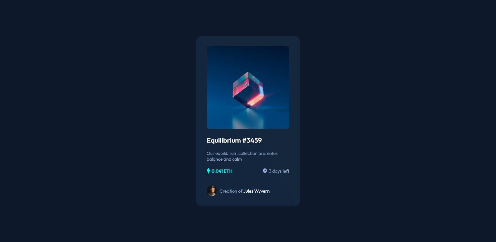

# Frontend Mentor - NFT preview card component solution

This is a solution to the [NFT preview card component challenge on Frontend Mentor](https://www.frontendmentor.io/challenges/nft-preview-card-component-SbdUL_w0U). Frontend Mentor challenges help you improve your coding skills by building realistic projects. 

## Table of contents

- [Overview](#overview)
  - [The challenge](#the-challenge)
  - [Screenshot](#screenshot)
  - [Links](#links)
- [My process](#my-process)
  - [Built with](#built-with)
  - [What I learned](#what-i-learned)
  - [Continued development](#continued-development)
  - [Useful resources](#useful-resources)
- [Author](#author)
- [Acknowledgments](#acknowledgments)

**Note: Delete this note and update the table of contents based on what sections you keep.**

## Overview

### The challenge

Users should be able to:

- View the optimal layout depending on their device's screen size
- See hover states for interactive elements

### Screenshot



### Links

- Solution URL: [Github](https://github.com/mfscode/nft-card)
- Live Site URL: [Live site](https://mfadil-nft.netlify.app/)

## My process

### Built with

- Semantic HTML5 markup
- CSS custom properties
- Flexbox

### What I learned

I just learned how to make an image to be a link and a step above that, I added an overlay for the image. I also have learned quite a bit of flexbox from my previous challenge so I implemented it in making the card, the status, and footer. I also refreshed my memory on svgs.

New thing that i learned is about using css selecetor, it's somewhat complicated for my current part of learning, but I sure am going to keep practising to keep improve!

```css
a.image:hover>.overlay {
    background-color: hsl(190, 82%, 59%, .5);
}
```

### Continued development

I want to sharpen and fine-tune my flexbox knowledge. New stuff is the css selecetor using +, >, and ~. I sure am needing to learn and implement those things in my future projects!

### Useful resources

- [Shadow](https://shadows.brumm.af/) - This helped me for making smooth shadows. I really liked this site and will use it going forward.
- [Css Selector - W3School](https://www.w3schools.com/cssref/css_selectors.asp) - This is an amazing article which helped me to try to understand the css selectors. I'd recommend it to anyone still learning this concept.

## Author

- Frontend Mentor - [@mfscode](https://www.frontendmentor.io/profile/mfscode)
- Twitter - [@mfskb3](https://www.twitter.com/mfskb3)
- Instagram - [@mfs_arc]()

## Acknowledgments

HUGE Thanks for frontendmentor crews that is helping me to improve my front-end skills 👍🎉. LOVE YOU GUYS
